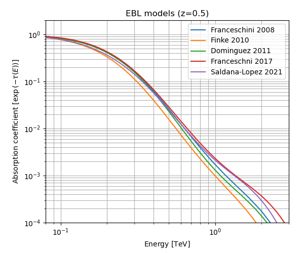

# Models for extragalactic background light (EBL)

Available models are:
 - Franceschini 2008:
   - Reference: [Franceschini, A.; Rodighiero, G.; Vaccari, M., 2008A&A...487..837F](http://adsabs.harvard.edu/abs/2008A%26A...487..837F)
   - Licence: Extragalactic optical-infrared background radiation, its time 
   evolution and the cosmic photon-photon opacity © 2008 by Alberto Franceschini -
   Padua University is licensed under [CC BY-NC-SA 4.0](https://creativecommons.org/licenses/by-nc-sa/4.0/).
 - Finke 2010 (http://adsabs.harvard.edu/abs/2009arXiv0905.1115F)
 - Dominguez 2011:
   - Reference:  [Dominguez, A., et al., 2011MNRAS.410.2556D](https://ui.adsabs.harvard.edu/abs/2011MNRAS.410.2556D/abstract)
   - Licence: Extragalactic background light inferred from AEGIS galaxy-SED-type fractions 
   © 2011 by Alberto Domínguez et al. is licensed under [CC BY-NC-SA 4.0](https://creativecommons.org/licenses/by-nc-sa/4.0/). 
 - Franceschini 2017
   - Reference: [Franceschini, A., Rodighiero, G. 2017A&A...603A..34F](https://ui.adsabs.harvard.edu/abs/2017A%26A...603A..34F)
   - Licence: Extragalactic optical-infrared background radiation, its time 
   evolution and the cosmic photon-photon opacity © 2017 by Alberto Franceschini -
   Padua University is licensed under [CC BY-NC-SA 4.0](https://creativecommons.org/licenses/by-nc-sa/4.0/).
 - Saldana-Lopez 2021:
   - References: [Saldana-Lopez, A., et al. 2021MNRAS.507.5144S](https://ui.adsabs.harvard.edu/abs/2021MNRAS.507.5144S),
   [Dominguez, A., et al., 2024MNRAS.527.4632D](https://ui.adsabs.harvard.edu/abs/2024MNRAS.527.4632D/abstract)
   - Licence: An observational determination of the evolving extragalactic background light 
   from the multiwavelength HST/CANDELS survey in the Fermi and CTA era © 2021 by Alberto 
   Saldana-Lopez is licensed under [CC BY-NC-SA 4.0](https://creativecommons.org/licenses/by-nc-sa/4.0/).

Todo: 
Format of binary files is referenced here: https://gamma-astro-data-formats.readthedocs.io/en/latest/
